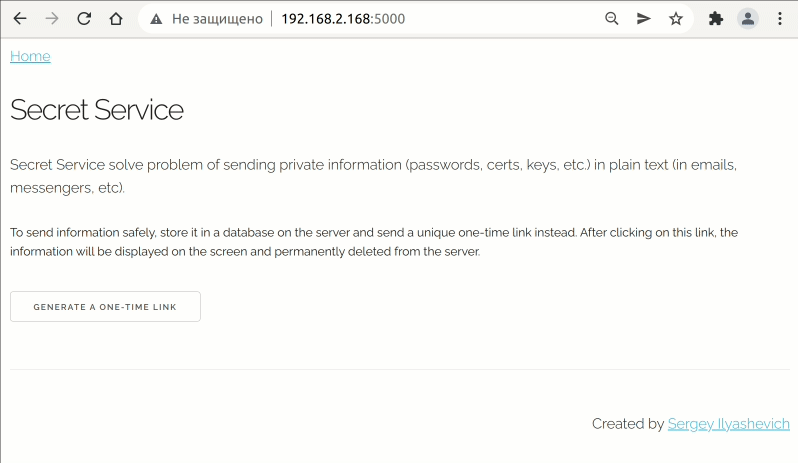

### Save private information and share it with one-time links 

#### Info

Web application solve problem of sending private information (passwords, certs, keys, etc.) in plain text (in emails, messengers, etc).
To send information, store it in a database on the server and send a unique one-time link instead.
After using link information will be permanently deleted from server. 
Fast, simple and safe.

#### Automation

For automation tasks, you can create one-time link by token from JSON format by result:  

```
http://server:port/make_url?secret=some_private_unformation
```

A one-time link can be formed like this:

```
http://server:port/get_secret?token=received_token 
```

#### Docker

Available at the link:

[https://hub.docker.com/r/silyashevich/secret_service](https://hub.docker.com/r/silyashevich/secret_service)


```
docker pull silyashevich/secret_service
```

If you want to persist the data in sqlite:

```console
docker run -d -p 5000:5000 -v /host/db/local-db:/code/db silyashevich/secret_service:latest
```


